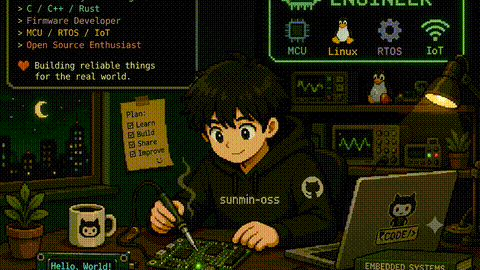

**Electronic Engineering @ National Kaohsiung University of Science and Technology (NKUST)**

---

##  About Me

-  電子工程系大三，專長橫跨 **AI/ML、嵌入式系統、全端開發**
-  **友達光電 (AUO)** 學期實習 (2026/02–2026/06) — 智慧會議室系統 IoT 工程師
-  高中時期參加 **第52屆全國技能競賽（機器人職類）**
-  熱愛旅行、探索不同文化

---

## Tech Stack

**Languages**

-6E4C13?style=flat)

**AI / ML / Vision**

**Web & Backend**

**Embedded & IoT**

**DevOps & Tools**

---

##  Featured Projects

### 藥知道 — AI 智慧藥物辨識系統 (MUS Project v1 & v2)
> 專題作品，為長輩設計的藥物辨識平台，從傳統電腦視覺演進至生成式 AI

| | v1 (傳統 CV) | v2 藥知道 (AI 增強) |
|---|---|---|
| **辨識方式** | OpenCV (LBP + ORB + 色彩形狀) | Gemini Vision VQA + RAG |
| **資料庫** | 4,775+ 筆藥物 | 4,416 筆 + 健保/食藥署即時查詢 |
| **後端** | Flask + SQLite | Flask + SQLite + Playwright 爬蟲 |
| **前端** | Vue.js 3 + Tailwind CSS | 無框架 SPA（長輩友善 UI） |
| **行動端** | — | Capacitor iOS App |
| **部署** | Vercel + Render | Docker + Vercel + Render |
| **管理工具** | C# WinForms 桌面應用 | Web Admin Dashboard |

**核心亮點：**
-  RAG 架構：將 300 筆真實藥物餵給 AI，有效防止幻覺
-  處方箋 OCR：支援手寫辨識
-  長輩優化 UI：18px+ 字體、大按鈕、高對比、3 步驟完成
-  三層 API 容錯：Gemini → Google Vision → Claude
-  串接健保署 / 食藥署即時資料

🔗 Repo: [`MUS_Project`](https://github.com/sunmin-oss/MUS_Project) · [`MUS_Project_v2`](https://github.com/sunmin-oss/MUS_Project_v2)

---

###  Trip Planner — 旅遊行程規劃 SPA
> React + Supabase 打造的一站式旅遊行程規劃應用

- **多行程管理**：東京/首爾/大阪京都範本行程一鍵套用
- **行程時間軸**：拖曳排序、跨天移動、智慧分類（餐飲/交通/購物）
- **成員管理**：建立旅伴名單，事件內指派成員
- **地圖整合**：Leaflet + OpenStreetMap 標記地點與路線
- **多幣別預算**：JPY 基準，即時換算 TWD / USD / EUR / KRW
- **打包清單**：內建常用物品一鍵加入
- **Tech**：React 19 + Vite 7 + Supabase (PostgreSQL + Auth + RLS) + Tailwind CSS 4
- **部署**：Cloudflare Pages

🔗 [線上體驗](https://tokyo-trip-exq.pages.dev/) · [`tokyo-trip`](https://github.com/sunmin-oss/tokyo-trip)

---

###  ESP32 環境監測站 (EMS)

使用 ESP32 + 多感測器打造即時環境監測儀表板

- **感測器**：BMP180（溫度/氣壓）、DHT11（濕度）、BH1750（光照）
- **顯示**：128×64 OLED (SSD1306) 即時儀表板 + 動態秒環動畫
- **連線**：Wi-Fi + NTP 時間同步，斷網仍可運作
- **開發**：PlatformIO + Arduino Framework

🔗 [`EMS`](https://github.com/sunmin-oss/EMS)

---

###  第52屆全國技能競賽 — 機器人
> 高中時期參加全國技能競賽，使用 LabVIEW 開發機器人控制系統

- **開發環境**：LabVIEW + KNRm 競賽用機器人控制板
- **視覺感測**：CCD 攝影機影像辨識，處理不同光源環境
- **動作控制**：多軸時序精確配合，模組化 SubVI 架構
- **操控**：羅技 F710 無線搖桿整合

🔗 [`52robot`](https://github.com/sunmin-oss/52robot)

---

###  車牌辨識系統
> 車輛牌照偵測與字元辨識專案

- 車牌區域偵測與定位
- 字元切割與辨識
- 含訓練/測試資料集

---

###  資料結構實作 (data_stact)
> C++ 資料結構演算法練習與實作

- **圖論**：Dijkstra 最短路徑、BFS、DFS、3D 迷宮路徑搜尋
- **樹結構**：Binary Tree 遍歷、Union-Find 並查集、MST 生成樹驗證
- **線性結構**：Doubly Linked List、Circular Queue、Stack
- **排序與搜尋**：常見排序演算法、搜尋演算法實作

🔗 [`data_stact`](https://github.com/sunmin-oss/data_stact)

---

###  8051 單晶片實作
> 8051 微控制器的組合語言與 C 語言實作，涵蓋多種通訊協定與周邊設備控制

- **通訊協定**：UART 串口通訊、HC-05 藍牙無線通訊
- **感測器**：DHT11 溫濕度感測、HC-SR04 超聲波測距、ADC0820 類比轉數位
- **控制**：Servo PWM 伺服馬達、L9110 馬達驅動
- **基礎**：LED I/O、指撥開關、中斷處理、計時器/計數器、鍵盤矩陣掃描

🔗 [`8051`](https://github.com/sunmin-oss/8051)

---

### 🔧 其他專案

| 專案 | 說明 | 技術 |
|------|------|------|
|  TASA 火箭導控 | TASTI 2026 Balloon Popping Challenge + ActiveRocketPy | Python, Gymnasium, 6-DoF 模擬 |
|  [`ESP32-C6-ThreadRouter`](https://github.com/sunmin-oss/ESP32-C6-ThreadRouter) | Thread 邊界路由器 | ESP-IDF, OpenThread |
|  [`retirement-planner`](https://github.com/sunmin-oss/retirement-planner) | 退休理財規劃計算器 ([線上體驗](https://retirement-planner-gamma.vercel.app)) | Node.js, Chart.js, Yahoo Finance API |
|  [`Minecraft_Lantern`](https://github.com/sunmin-oss/Minecraft_Lantern) | Minecraft 風格 LED 燈 | Arduino, WS2812, GY-80 |
|  Local LLaMA Chatbot | 離線 LLaMA 聊天機器人 | Python, Hugging Face |
|  CPE 題庫爬蟲 | 自動爬取 CPE 題目並依星等分類 | Python, Web Scraping |
|  課程查詢系統 | 校內課程篩選桌面應用 | C# WinForms, Excel |
|  [`ComputerNetworking`](https://github.com/sunmin-oss/ComputerNetworking) | 計算機網路實作 | Python |
|  [`musical-octo-spork`](https://github.com/sunmin-oss/musical-octo-spork) | 期末 VHDL/Verilog 專案 | Verilog |

---

##  Experience & Competitions

| 時間 | 事項 |
|------|------|
| 2026 | 行動應用創新競賽 — 藥知道 |
| 2026/02–06 | **友達光電 (AUO) 學期實習** — 智慧會議室系統 IoT 工程師 |
| 2025–2026 | 校內專題競賽 — 藥知道 AI 藥物辨識系統 |
| 高中 | 第52屆全國技能競賽 — 機器人職類 |

---

##  GitHub Stats

<picture>
  <source media="(prefers-color-scheme: dark)" srcset="https://raw.githubusercontent.com/sunmin-oss/sunmin-oss/output/github-contribution-grid-snake-dark.svg" />
  <source media="(prefers-color-scheme: light)" srcset="https://raw.githubusercontent.com/sunmin-oss/sunmin-oss/output/github-contribution-grid-snake.svg" />
  
</picture>

---

##  Motto

> 用 AI 加速開發，用硬體落地實現，最短路徑解決真實問題。  
> *"Accelerate with AI, land on hardware, solve real problems by the shortest path."*

---

Thanks for visiting! Feel free to check out my projects 🌏  
Let's chat about **AI, Embedded Systems, Rockets, or Travel** ✨

